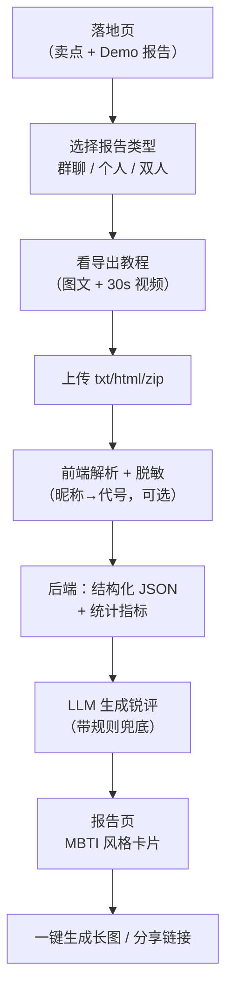
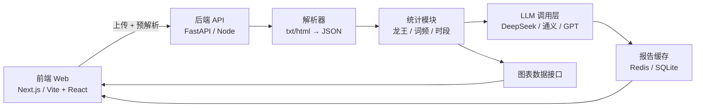
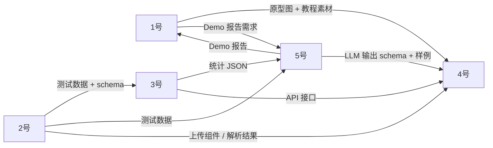

<aside>
🎯

**一句话定位**：上传微信聊天记录 → AI 出一份有梗的"人格 / 龙王 / 关系"报告 → 一键生成卡片分享朋友圈。

**核心传播逻辑**：低门槛上传 + 出片感强的报告页 + 朋友愿意 @ 别人围观。

</aside>

## 一、10 天版 MVP 范围（先砍到能做完）

| 维度 | 10 天 MVP（必做） | 砍掉 / 延后 |
| --- | --- | --- |
| 平台 | Web（移动端浏览器适配） | 小程序 |
| 数据源 | **微信 PC 端导出 txt 一种格式** | html / dat / QQ / 截图 OCR |
| 报告类型 | ① 群聊锐评（龙王 + 元宝 + 群人设）
② 双人关系锐评
个人人格作为副产品从①里直接出 | 独立的个人 MBTI 测试小工具 |
| 账号 | **免登录**，share_slug 链接分享 | 账号系统、历史记录 |
| 隐私 | 前端脱敏 + 后端不存原始消息 | 端侧推理 |

<aside>
⚠️

**优先级原则**：能不做就不做。数据库尽量轻，原始消息不落库，只存"结构化分析结果 JSON + 报告 ID"。

</aside>

## 二、用户主流程（端到端）

**体验关键点**：

- 上传页要像"拖个文件就行"，不要让用户先注册。
- 教程做成 GIF / 短视频内嵌，**不要让用户跳出去搜怎么导出**。
- 报告页第一屏必须是"金句 + 大字标题 + 头像 / emoji"，滚动下去才是详细图表。
- 分享卡片要内置二维码 + 一句钩子文案（"来测测你在群里是几号龙王"）。

## 三、技术架构（建议）

**数据库**（够用就行）：

- `reports`：report_id、type、created_at、stats_json、llm_json、share_slug
- `share_logs`（可选）：访问统计，用于看哪种报告传播好
- 原始聊天文本：**不落库**，处理完即销毁

## 四、五人任务清单（详细版）

### 1 号 · PM + 内容 + 原型 + 视频

<aside>
📋

前期主线：原型 + 文档 + Demo 数据。后期主线：视频 + 答辩。是整个项目的"对外门面 + 进度盯人"。

</aside>

**项目管理**

- [ ]  主持 Kickoff 会议，落地 schema / 接口 / 分工三份契约
- [ ]  维护团队进度表（每天更新每个人的 in-progress / blocked）
- [ ]  每天 10 分钟站会主持人
- [ ]  整理团队 GitHub 仓库结构（前端 / 后端 / 文档 / 测试数据 4 个目录）

**项目文档与简介**

- [ ]  项目简介 3 个版本：一句话（朋友圈用）/ 一段话（提交表单用）/ 一页 PPT（答辩开场用）
- [ ]  写 README（含安装、运行、目录结构、技术栈、贡献者）
- [ ]  写隐私声明页（强调原始消息不落库，作为产品卖点）

**原型与视觉规范**

- [ ]  画 5 屏原型（Figma / 即时设计）：落地页 / 上传页 / 分析中页 / 报告页 / 分享卡片
- [ ]  定一份极简视觉规范：主色 / 辅助色 / 字体 / 圆角 / 间距（一页 Figma 即可），**D2 给到 4 号**
- [ ]  落地页的 Demo 报告图（静态长图）先画一张，给 4 号参考、给视频用

**使用教程**

- [ ]  写微信导出步骤的图文教程（截图 6–8 张，每张配一句话）
- [ ]  录一段 30s 演示 GIF（手机端 / 电脑端各一份），交给 4 号嵌进上传页
- [ ]  准备 FAQ 5 条（导出失败怎么办 / 文件太大 / 隐私问题 / 没有结果 / 分享失败）

**视频**

- [ ]  写 6 分钟视频脚本 + 分镜表（痛点 30s → Demo 3min → 技术亮点 1min → 隐私/价值观 1min → 团队 30s）
- [ ]  准备真实操作录屏（用 Demo 数据走完整流程，2–3 条不同样本）
- [ ]  拍摄团队介绍 + 关键讲解片段
- [ ]  用剪映剪辑、配字幕、配 BGM、出片
- [ ]  至少导出两个版本：横屏（答辩用）+ 竖屏 9:16（小红书 / B 站手机版）

**答辩**

- [ ]  答辩 PPT（不超过 10 页，逻辑：是什么 → 给谁用 → 怎么做的 → 亮点 → Demo → 团队）
- [ ]  整理 Q&A 清单（隐私 / 准确性 / 商业模式 / 技术栈 / 未来规划，每条准备 2 句话答案）
- [ ]  模拟一次答辩，邀请 2–5 号轮流问问题

**兼职协作**

- [ ]  帮 5 号测 Prompt（用自己/朋友的聊天记录，每天反馈"哪里不够好笑 / 哪里像 AI 味"）
- [ ]  和 5 号一起写宣传文案：小红书 3 篇 / 朋友圈 2 套 / B 站标题 5 个 / 微博 3 条

### 2 号 · 数据导入与解析（前端侧）

<aside>
📥

用户体验的"第一公里"，最容易劝退用户的环节。目标：**点 3 下以内**完成导入**且原始文件不离开浏览器**。

</aside>

**调研与方案选型**

- [ ]  调研微信导出方案：PC 微信官方迁移、留痕、WechatExporter、安卓导出，列一份**风险/合规对照表**
- [ ]  敲定唯一支持的格式（推荐 PC 微信"聊天记录迁移到电脑"导出的 txt），写文档说明为什么选这种
- [ ]  对比 txt / html / csv / json 几种格式的结构差异，写一份《格式对照备忘》给 3 号 / 5 号

**测试数据**

- [ ]  至少 3 份脱敏测试数据：小群聊（< 100 条）/ 大群聊（> 5000 条）/ 双人单聊（活跃情侣 or 闺蜜）
- [ ]  2 份边界数据：纯表情包群 / 工作群（含大量链接和文件）
- [ ]  把所有测试数据放到团队仓库 `/test-data/`，写 README 说明每份数据的特征

**解析器（核心代码）**

- [ ]  定义统一 schema 并写成 TypeScript / JSDoc 类型，提交到仓库：`{ msg_id, sender, ts, type, content, reply_to? }`
- [ ]  文件类型自动识别（txt / html / zip 解包）
- [ ]  文本逐行解析：识别发送者、时间戳、消息体、消息类型
- [ ]  多行消息合并（一条消息跨多行的情况）
- [ ]  异常消息处理：撤回 / 转账 / 红包 / 系统消息 / 图片占位 / 表情包 / 文件 / 引用回复 / 链接卡片
- [ ]  时间戳归一化（统一成 ISO 8601）
- [ ]  大文件分片解析 + 进度回调（10w+ 消息不卡浏览器）
- [ ]  Web Worker 把解析放到后台线程，避免主线程卡顿

**脱敏模块**

- [ ]  昵称 → 代号映射（A/B/C 默认 + 用户可在 UI 自定义）
- [ ]  正则脱敏：手机号 / 身份证号 / 银行卡 / 邮箱 / 链接 URL
- [ ]  提供"脱敏开关"，用户可以选关闭（默认开）
- [ ]  输出脱敏映射表（仅在浏览器内存），便于报告页把代号还原成用户自定义昵称

**与后端 / 前端对接**

- [ ]  调 3 号的 `POST /api/analyze`，传结构化 JSON，处理上传进度和错误
- [ ]  把解析器包成 npm 内部包 / 模块，4 号能直接 import 用到上传页
- [ ]  写 5 个以上单元测试用例（覆盖正常 / 撤回 / 长引用 / 极端字符 / 表情）

**兼职协作**

- [ ]  和 4 号一起把上传页打磨到"傻瓜级"：拖拽 / 点击 / 粘贴文本三种方式 + 错误提示文案
- [ ]  帮 1 号录制"标准导出流程"的演示数据，供视频使用

### 3 号 · 后端 + 数据 + 统计

<aside>
🛠️

核心是"把消息 JSON 变成可视化指标 + 喂给 LLM 的精简 JSON"。建议 FastAPI + SQLite，能跑就行。

</aside>

**项目骨架**

- [ ]  后端项目初始化（FastAPI / Express 二选一），配置 lint / 格式化 / .env
- [ ]  数据库初始化 SQLite（一张 `reports` 表就够）
- [ ]  写一份 `README` 说明如何起服务、跑测试、看日志
- [ ]  CORS / 文件大小限制 / 简单速率限制（每 IP 每分钟 5 次）

**API 接口**

- [ ]  `POST /api/analyze`：收 2 号的结构化 JSON → 跑统计 → 调 LLM → 返回 `report_id`
- [ ]  `GET /api/report/:id`：返回统计数据 + LLM 结果给 4 号渲染
- [ ]  `POST /api/share/:id`：把某个 report 标记为可分享，返回 `share_slug`
- [ ]  `GET /api/share/:slug`：公开分享页查询
- [ ]  所有接口写 OpenAPI / Swagger 文档（FastAPI 自带，Node 用 swagger-ui-express）
- [ ]  **Mock 模式**：所有接口加一个 `?mock=1` 参数，返回写死的假数据，**D1 当天就提供**给 4 号 / 5 号并行开发

**统计模块（给 4 号画图 + 给 5 号喂 LLM）**

- [ ]  龙王榜：每个人的消息数 / 字数 / 表情包数 / 平均长度 / Top N 排名
- [ ]  时段热力图：24h × 7d 二维数组，标记每个人的活跃时段
- [ ]  关键词：分词（jieba）+ 停用词过滤 + 词频 Top 50
- [ ]  N-gram 高频梗 / 口头禅：2-gram、3-gram、4-gram 各取 Top 20
- [ ]  互动关系：@ 次数矩阵 / 回复链长度 / 谁回谁多 / 双人对话密度
- [ ]  表情包统计：Top N 使用最多的表情包 / 每个人的表情包偏好
- [ ]  群体特征：日活人数曲线 / 周末 vs 工作日活跃度 / 深夜活跃指数
- [ ]  双人专属指标（关系报告用）：消息比例 / 主动开启对话次数 / 平均回复延迟 / 连续对话最长时长

**LLM 输入打包**

- [ ]  把统计结果压缩成 < 8k token 的"精简 JSON"，给 5 号当 LLM 输入
- [ ]  摘取代表性消息：每人 5–10 条最具代表性的发言（按长度 / 表情 / 互动度打分挑选）
- [ ]  摘要语气特征（每人的常用词、句长分布、Emoji 使用偏好）

**部署与运维**

- [ ]  选一个最简单的部署方案（Vercel / Railway / 自家服务器 + nginx），写好部署脚本
- [ ]  配置环境变量（LLM API key、数据库路径），区分 dev / prod
- [ ]  简单的日志（请求量 / 错误率 / LLM 调用次数和成功率）

**兼职协作**

- [ ]  和 2 号每天对一次 schema，确保前后端字段没漂移
- [ ]  和 5 号确认 LLM 输入输出格式，约好谁负责 prompt 拼装、谁负责调 API

### 4 号 · 前端与视觉

<aside>
🎨

参考 16personalities 报告页、网易云年度报告、Spotify Wrapped。出片感 = 传播力。10 天内要敢于复用模板库和组件库。

</aside>

**项目搭建**

- [ ]  技术栈敲定（建议 Vite + React + TypeScript + TailwindCSS + shadcn/ui）
- [ ]  路由 + 状态管理（Zustand / Jotai 之类轻量级）
- [ ]  设计 token：基于 1 号给的视觉规范，定义颜色 / 字号 / 间距 / 圆角变量
- [ ]  通用组件库：Button / Card / Modal / Toast / Progress / Tooltip / Avatar
- [ ]  字体加载（建议中文用思源黑体或鸿蒙字体子集）

**5 个页面**

- [ ]  **落地页**：Hero（一句话 slogan + CTA）/ 卖点三栏 / Demo 报告预览图 / FAQ / 底部隐私声明
- [ ]  **上传页**：拖拽区 + 点击上传 + 粘贴文本三种方式，教程 GIF 内嵌，脱敏开关，文件大小 / 类型校验
- [ ]  **分析中页**：loading 动画 + 滚动文案（"正在统计哈哈哈数量…" / "正在挖元宝语录…" / "正在让 AI 想锐评…"）
- [ ]  **报告页**：多屏分段滚动，每屏一个金句 + 一个图表，最后一屏分享卡片
- [ ]  **分享页**：纯展示，不含上传入口，带二维码 + 钩子文案 + 引导按钮（"我也要测"）

**图表组件**

- [ ]  龙王榜（横向柱状图 + 头像 + Top 3 大字突出）
- [ ]  时段热力图（24h × 7d 网格）
- [ ]  关键词云（词频驱动字号 + 颜色随机）
- [ ]  人格雷达图（4–6 个维度）
- [ ]  关系密度图（双人报告用，箭头粗细表示主动程度）
- [ ]  表情包 Top 榜（带表情图片）
- [ ]  时间轴（双人关系：什么时候第一次说"晚安" / 连续聊最久的一天）

**金句卡片**

- [ ]  设计一个通用"金句卡片"组件，5 号给的每个 quote 都可以渲染成统一样式
- [ ]  给每个金句配合适的图标 / Emoji（5 号 schema 里包含）

**长图与分享**

- [ ]  html2canvas 把报告页渲染成竖版长图（适配朋友圈 1080×N）
- [ ]  长图水印 + 二维码（链接到 share 页）
- [ ]  分享链接生成（调 3 号 `POST /api/share/:id`）
- [ ]  复制链接 / 保存图片 / 系统分享三个按钮

**响应式与体验**

- [ ]  移动端浏览器适配（375 / 414 / 768 三档断点）
- [ ]  报告页加滚动进度条 + "下一屏"提示
- [ ]  错误页面 / 空数据 / 加载失败的兜底 UI
- [ ]  SEO Meta（分享到微信 / 微博时的卡片预览图和文案）

**和后端联调**

- [ ]  第一天先用 3 号的 mock 接口跑通整条链路，**不等真实数据**
- [ ]  真实接口出来后逐个替换 mock
- [ ]  处理 loading / 超时 / 错误 / 空数据 4 种状态

**兼职协作**

- [ ]  和 2 号一起打磨上传页交互（重点：傻瓜化、教程内嵌）
- [ ]  给 1 号视频里的 Demo 数据准备好看的截图素材

### 5 号 · AI 报告内容 + Prompt + LLM 调用

<aside>
🤖

产品的"灵魂"。**D2 之前必须拿假数据把 Prompt 跑出来**，让 1 号 / 4 号能基于真实 LLM 输出做视频和报告页。

</aside>

**报告内容设计**

- [ ]  **群聊锐评**内容大纲：
    - 群名称 + 群人设标签（如"赛博发癫精神病院" / "嘴硬恋爱观察小组"）
    - 群氛围一段锐评（200–300 字）
    - 龙王榜 Top 5（每人配代号 + 一句锐评）
    - 元宝语录 Top 5（高频梗 + 谁说的 + 锐评）
    - 神金时刻（最离谱的对话片段 + AI 锐评）
    - 群体标签（深夜放毒群 / 加班互助群 / 嘴硬恋爱观察组…）
- [ ]  **双人关系锐评**内容大纲：
    - 关系定性（普通朋友 / 暧昧期 / 老夫老妻 / 互相忍受…）
    - 谁更主动（消息比例 + 主动开启对话比例）
    - 相处模式（捧哏-逗哏 / 双吐槽 / 单向输出 / 互相安慰）
    - CP 度评分 + 一段解读
    - 神金语录 Top 5
    - 一句"AI 给的关系建议"（带梗、不严肃）

**Prompt 工程**

- [ ]  写 System Prompt v1，跑通基本流程
- [ ]  v2 迭代：加 Few-shot 样例（至少 3 组：好群聊 / 平淡群聊 / 工作群分别给出的报告样例）
- [ ]  v3 迭代：调语气、调长度、调输出稳定性
- [ ]  固定输出 JSON schema：`{ title, tagline, sections: [{type, heading, body, chart_ref?}], quotes: [{speaker, text, comment}], tags: [...] }`
- [ ]  安全红线 Prompt：不开盒 / 不挂人 / 不输出真实姓名 / 避免歧视 / 政治宗教敏感词过滤
- [ ]  输出后的二次校验：正则过滤敏感词 + JSON schema 校验，校验失败重试 1 次后走兜底

**LLM 调用层**

- [ ]  选定 LLM（建议主用 DeepSeek 或通义千问，备 GPT-4o-mini），写一份对比测评（成本 / 中文质量 / 速度）
- [ ]  实现统一的 LLM client（支持多家 API 切换、超时控制、重试逻辑）
- [ ]  Token 计算与控制（输入超长时自动截断/抽样）
- [ ]  调用日志：每次调用的 prompt、response、耗时、成本，方便复盘
- [ ]  **规则版兜底**：当 LLM 失败 / 超时 / 返回非法 JSON / 触发安全过滤时，用模板拼一份基础报告（基于 3 号的统计数据 + 预设话术）保证不开天窗

**评测与调优**

- [ ]  用 2 号提供的 3 份测试数据各跑 5 次报告，人工打分（是否有梗 / 是否准确 / 是否过线）
- [ ]  写一份 Prompt 调优记录（v1 → v2 → v3 改了什么、为什么）
- [ ]  收集团队成员的真实反馈（让 1/2/3/4 号都用自己的聊天记录测一遍）

**宣传文案**

- [ ]  小红书风 3 篇（含标题、正文、3 个 hashtag）
- [ ]  朋友圈 2 套（短版 + 长版）
- [ ]  B 站 / 抖音标题 5 个
- [ ]  一句话 slogan 3 个候选（让 1 号 / 4 号投票选）

**兼职协作**

- [ ]  和 1 号一起做 Demo 数据：用一份"看起来很炸"的聊天记录，跑出最有梗的报告，给视频用
- [ ]  和 4 号确认 LLM 输出 schema 的每个字段怎么渲染，保证前端不会因为字段为空崩掉

## 五、协作流程

<aside>
🔗

10 天没时间互相等。下面这套"先签合同再开工"的协作流程必须在 Kickoff 当天敲定。

</aside>

### 5.1 三份必须最早冻结的"契约"

| 契约 | 负责人 | 使用方 | 必须冻结时机 |
| --- | --- | --- | --- |
| 消息统一 schema（解析输出） | 2 号 | 3 号 | Kickoff 当天 |
| LLM 输入 + 输出 JSON schema | 5 号 | 3 号 / 4 号 | 第 2 天前 |
| 后端 API 接口契约 | 3 号 | 2 号 / 4 号 | 第 2 天前 |

这三份 schema 一旦冻结，**只允许加字段，不允许改名 / 删字段**。改名要在群里 @ 所有相关人确认。

### 5.2 上下游交付链（谁给谁什么）

### 5.3 日常协作节奏

- **每天 10 分钟站会**（线上或线下都行）：每人说"昨天做完啥 / 今天做啥 / 卡哪了"
- **共享 Mock 数据**：2 号最迟第 1 天末把脱敏的单聊 + 群聊样例丢到团队仓库，所有人都用这份调试
- **打通主链路优先**：前 3 天目标是"假数据从上传到报告页跑通"，所有人都先做最糙的版本，**不要任何人憋大招**
- **接口先 Mock 再联调**：3 号把接口先返回写死的假数据，4 号 / 5 号不用等真实数据就能并行开发
- **隐私红线**：原始消息**永远不落库**，前端处理 / 内存处理完即销毁，写进产品介绍当卖点

### 5.4 阻塞处理

- 谁卡住超过 2 小时，必须在群里 @ 相关人，别一个人闷头死磕
- 任何 schema / 接口的改动，**先在群里发文字版本说明**，再改代码
- LLM 调不通时，5 号要立刻切到"规则版兜底"，不能让 4 号阻塞在等真实输出

## 六、需要拍板的几个点

- [ ]  技术栈：前端 Next.js 还是 Vite？后端 FastAPI 还是 Node？
- [ ]  LLM 用谁的 API（成本 + 中文质量 + 合规）？
- [ ]  是否做账号系统（建议 MVP 不做，靠 share_slug 链接分享）
- [ ]  微信导出方案的合规边界（建议只支持官方"聊天记录迁移到电脑" + 用户主动导出 txt，不碰 dat 解密）
- [ ]  引流入口是先做 MBTI 测试还是先做 Demo 报告？